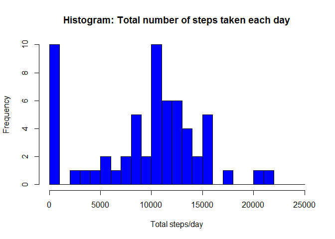
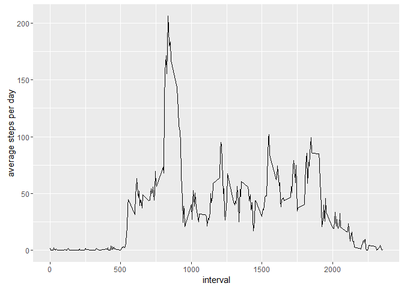
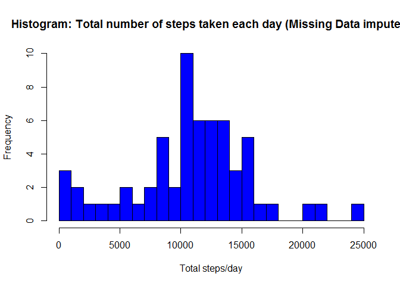
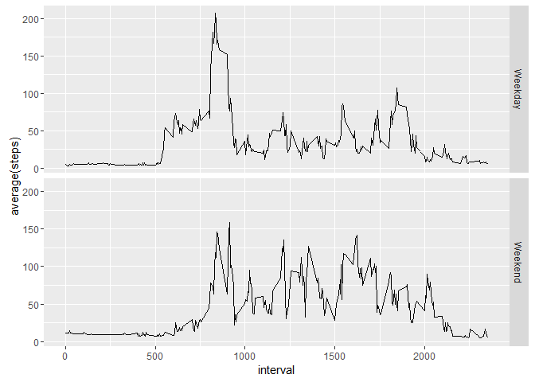

# Reproducible Research: Peer Assessment 1

## Loading and preprocessing the data
### Unzipping, if data file not already present

```r
if(!file.exists('activity.csv')){
    unzip('activity.zip')
}
```
### Loading the dataset from file

```r
activityData <- read.csv('activity.csv')
```

## What is mean total number of steps taken per day?
### Histogram of the total number of steps taken each day

```r
stepsPerDay <- tapply(activityData$steps, activityData$date, sum, na.rm=TRUE)
hist(stepsPerDay, breaks=seq(from=0, to=25000, by=1000),
     main='Histogram: Total number of steps taken each day',
     xlab='Total steps per day', 
     ylab='Frequency',
     col="blue")
```

<!-- -->

### Mean and median number of steps taken each day

```r
stepsPerDayMean   <- mean(stepsPerDay)
stepsPerDayMedian <- median(stepsPerDay)
```
* Mean:    9354.2295082
* Median:  10395

## What is the average daily activity pattern?

```r
avgStepsPerInterval <- aggregate(x=list(meanSteps = activityData$steps),
                                 by=list(interval  = activityData$interval),
                                 FUN=mean, na.rm=TRUE)
library(ggplot2)
ggplot(data=avgStepsPerInterval, aes(x=interval, y=meanSteps)) +
  geom_line() +
  xlab("interval") +
  ylab("average steps per day")  
```

<!-- -->

### The 5-minute interval that, on average, contains the maximum number of steps

```r
maxStepIndex   <- which.max(avgStepsPerInterval$meanSteps)
maxStepTimeRaw <- avgStepsPerInterval[maxStepIndex,'interval']
maxStepTimeFormatted <- gsub("([0-9]{1,2})([0-9]{2})", "\\1:\\2", maxStepTimeRaw)
```
* Interval = 8:35

## Imputing missing values
Missing values are filled with the average of the corresponding interval

```r
imputedData  <- activityData
invalidIndex <- is.na(imputedData$steps)
mergedData   <- merge(imputedData[invalidIndex, ], avgStepsPerInterval, by = "interval")
imputedData[invalidIndex,]$steps <- mergedData$meanSteps
```
*Number of obervations with missing values: 2304

### Histogram of the total number of steps taken each day after missing values are imputed

```r
imputedStepsPerDay <- tapply(imputedData$steps, imputedData$date, sum)
hist(imputedStepsPerDay, breaks=seq(from=0, to=25000, by=1000),
     main='Histogram: Total number of steps taken each day (Missing Data imputed)',
     xlab='Total steps per day', 
     ylab='Frequency',
     col="blue")
```

<!-- -->

## Are there differences in activity patterns between weekdays and weekends?

```r
imputedData$dayType <- ifelse(as.POSIXlt(imputedData$date)$wday %in% c(0,6), 'Weekend', 'Weekday')
avgImputedbyDayType <- aggregate(steps ~ interval + dayType, data=imputedData, mean)
ggplot(avgImputedbyDayType, aes(interval, steps)) + 
  geom_line() + 
  facet_grid(dayType ~ .) +
  xlab("interval") + 
  ylab("average(steps)")
```

<!-- -->
